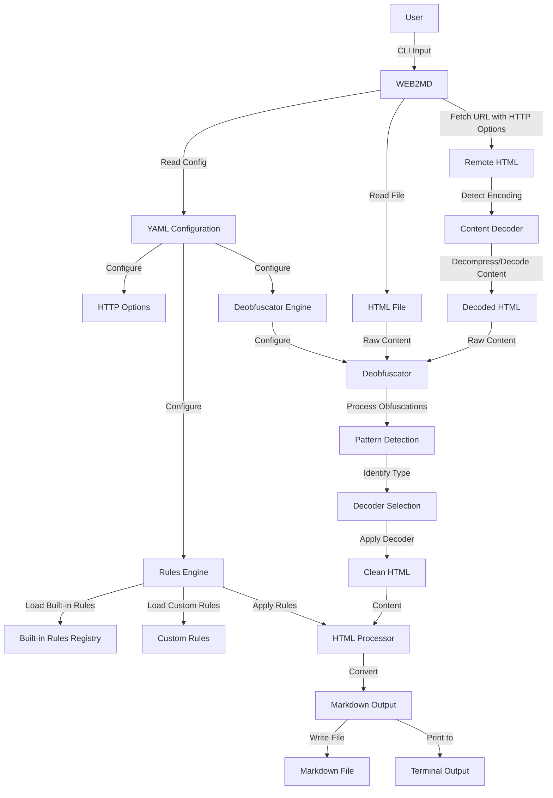

# WEB2MD: YAML-Based Rules System Specification

## Core Architecture

WEB2MD is a Node.js CLI application that transforms HTML webpages into semantically structured Markdown documents. At the heart of this conversion process lies a strictly-defined YAML-based rules system that defines how HTML elements are transformed into their Markdown counterparts.

## System Overview

The WEB2MD architecture follows a simple input-process-output pipeline:

1. **Input**: HTML content from files or URLs (with customizable HTTP options)
2. **Pre-Process**: Apply deobfuscation and handle content encoding/compression
3. **Process**: Apply conversion rules to transform HTML to Markdown
4. **Output**: Write Markdown content to file or stdout

The YAML-based rules system controls the transformation process, allowing for customization while providing sensible defaults.

## Technology Stack

The implementation relies on the following key technologies:

- Node (^22.14.0): Main engine
- commander (^13.1.0): Command-line interface parsing and execution
- chalk (^5.4.1): Terminal styling for intuitive user feedback
- node:fs/promises: Native file system operations for input/output
- got (^14.4.7): HTTP client for retrieving remote content
- turndown (^7.2.0): Core HTML-to-Markdown conversion engine
- @types/turndown (^5.0.5)
- typescript (^5.8.3): Type safety and improved developer experience
- eslint (^9.24.0): Code quality enforcement and style consistency
- @typescript-eslint/eslint-plugin: (^8.29.1)
- @typescript-eslint/parser: (^8.29.1)
- esbuild (^0.25.2)
- tsx (^4.19.3): TypeScript execution for development and testing
- zod (^3.24.2): Schema validation for configurations and rules
- pnpm: Efficient package management
- vitest (^3.1.1): Modern testing framework
- js-yaml (^4.1.0): YAML parsing for rules and configuration
- jsdom (^26.1.0)
- @types/jsdom (^21.1.7)
- tough-cookie (^5.1.2)
- @types/tough-cookie (^4.0.5)
- https-proxy-agent (^7.0.6)
- mathjax-node (^2.1.1)
- zstd-napi (^0.0.10)

## System Flow



## Type System Architecture

WEB2MD employs a dedicated, centralized type system for maximum maintainability and clarity:

```
src/
├── types/                        # Central location for all type definitions
│   ├── index.ts                  # Exports all shared types
│   ├── core/                     # Core application types
│   │   ├── index.ts              # Exports all core types
│   │   ├── rule.ts               # Rule-related core types
│   │   ├── config.ts             # Configuration-related core types
│   │   ├── deobfuscation.ts      # Deobfuscation-related core types
│   │   ├── http.ts               # HTTP-related core types
│   │   └── io.ts                 # Input/Output-related core types
│   ├── modules/                  # Module-specific types
│   │   ├── index.ts              # Exports all module types
│   │   ├── cli.ts                # CLI module types
│   │   ├── config.ts             # Config module types
│   │   ├── rules.ts              # Rules module types
│   │   ├── deobfuscator.ts       # Deobfuscator module types
│   │   ├── http.ts               # HTTP module types
│   │   ├── decoder.ts            # Content decoder module types
│   │   ├── converter.ts          # Converter module types
│   │   └── io.ts                 # I/O module types
│   └── vendor/                   # Third-party library type augmentations
│       ├── index.ts              # Exports all vendor type augmentations
│       ├── turndown.d.ts         # Turndown type declarations
│       ├── got.d.ts              # Got HTTP client type extensions
│       └── jsdom.d.ts            # JSDOM type declarations (if needed)
```

This type system provides clear organization, centralized type management, and properly isolated third-party type definitions. Key benefits include:

1. **Centralized Type Management**: All types are located in a dedicated directory
2. **Clear Type Categorization**: Types are organized by their purpose
3. **Simplified Imports**: The index files provide convenient, consolidated exports
4. **Improved Integration**: Third-party library augmentations are clearly isolated
5. **Reduced Duplication**: All modules reference types from a single location

## HTTP Options and Content Handling

The web2md tool supports customizable HTTP options and automatic handling of compressed content, allowing more control over how content is retrieved from the web.

### HTTP Options

HTTP options can be specified in the configuration file (`web2md.yaml`).

Example HTTP configuration within `web2md.yaml`:

```yaml
# web2md.yaml
headingStyle: atx      # atx (#) or setext (===)
listMarker: "-"        # -, *, or +
codeBlockStyle: fenced # fenced (```) or indented (4 spaces)
preserveTableAlignment: true

# HTTP options
http:
  userAgent: "Mozilla/5.0 (Windows NT 10.0; Win64; x64) AppleWebKit/537.36 (KHTML, like Gecko) Chrome/122.0.0.0 Safari/537.36 Edg/122.0.0.0"
  compression:
    enabled: true
    formats:
      - gzip
      - br
      - deflate
      - zstd
  requestOptions:
    timeout: 30000
    retry: 3
    followRedirects: true
    maxRedirects: 10
    throwHttpErrors: false
  cookies:
    enabled: true
    jar: true
  headers:
    Accept: "text/html,application/xhtml+xml,application/xml;q=0.9,image/webp,image/apng,*/*;q=0.8"
    Accept-Encoding: "gzip, deflate, br, zstd"
    Accept-Language: "en-US,en;q=0.9"
    Cache-Control: "no-cache"
    Connection: "keep-alive"
    DNT: "1"
  proxy:
    enabled: false
    url: "http://proxy.example.com:8080"
    auth:
      username: ""
      password: ""

# Tags to completely ignore during conversion
ignoreTags:
  - script
  - style
  - noscript
  - iframe

# Either use all built-ins (default if this section is omitted)
useBuiltInRules: true

# Or explicitly select which built-in rule sets to use
builtInRules:
  - common-elements    # Basic HTML elements (headings, paragraphs, lists)
  - text-formatting    # Bold, italic, etc.
  - text-links         # Hyperlinks and references
  - media-images       # Images and figures
  - tables             # Table formatting
  - code-blocks        # Code blocks with language highlighting
  - math               # Mathematical expressions
  - deobfuscation      # Link and email deobfuscation rules

# Custom rules to extend or override built-ins (must be absolute paths or relative to working directory)
customRules:
  - ./my-rules/special-blocks.yaml  # Custom YAML rules
  - ./my-rules/math-enhanced.js     # Custom JS rules

# Deobfuscation options
deobfuscation:
  enabled: true                    # Enable deobfuscation module
  decoders:
    - cloudflare                   # Cloudflare email protection
    - base64                       # Base64-encoded links and content
    - rot13                        # ROT13 encoded text
  emailLinks: true                 # Convert to 'mailto:' links after decoding
  cleanScripts: true               # Remove deobfuscation scripts when found
  preserveRawLinks: false          # Keep the original link in an HTML comment

# Debug mode for detailed logging
debug: false
```

### Content Handling

The system automatically handles various content encodings and compression methods that websites might serve:

1. **Automatic Detection**: The system detects the content encoding from HTTP headers
2. **Decompression**: Compressed content is automatically decompressed before processing
3. **Character Encoding**: Different character encodings are handled appropriately
4. **Fallback Mechanisms**: If encoding detection fails, the system uses heuristics to determine the encoding

#### Supported Content Encodings

The following compression methods are supported:

- **gzip**: The most common compression method used on the web
- **deflate**: An older compression method still in use on some websites
- **br** (Brotli): A newer, more efficient compression algorithm
- **zstd** (Zstandard): An advanced compression method gaining popularity

#### Character Encodings

In addition to content compression, the system handles various character encodings:

- UTF-8 (default)
- UTF-16 (LE/BE)
- ISO-8859-1
- Windows-1252
- And other common encodings

### YAML-Based Rules System

The YAML-based rules system defines how HTML elements are transformed into Markdown. The system provides:

1. **Smart Defaults**: All built-in rules are applied without any configuration
2. **Selective Activation**: Easy enabling/disabling of specific rule sets
3. **Custom Extensions**: Simple addition of custom rules
4. **Clear Precedence**: Explicit rule priority handling

### Configuration Schema

The configuration file (`web2md.yaml`) supports the following options:

```yaml
# web2md.yaml
headingStyle: atx      # atx (#) or setext (===)
listMarker: "-"        # -, *, or +
codeBlockStyle: fenced # fenced (```) or indented (4 spaces)
preserveTableAlignment: true

# HTTP options
http:
  userAgent: "Mozilla/5.0 (compatible; WEB2MD/1.0; +https://github.com/yourname/web2md)"
  compression:
    enabled: true
    formats:
      - gzip
      - br
      - deflate
  requestOptions:
    timeout: 30000
    retry: 3
  headers:
    Accept: "text/html,application/xhtml+xml,application/xml;q=0.9,*/*;q=0.8"

# Tags to completely ignore during conversion
ignoreTags:
  - script
  - style
  - noscript
  - iframe

# Either use all built-ins (default if this section is omitted)
useBuiltInRules: true

# Or explicitly select which built-in rule sets to use
builtInRules:
  - common-elements    # Basic HTML elements (headings, paragraphs, lists)
  - text-formatting    # Bold, italic, etc.
  - text-links         # Hyperlinks and references
  - media-images       # Images and figures
  - tables             # Table formatting
  - code-blocks        # Code blocks with language highlighting
  - math               # Mathematical expressions
  - deobfuscation      # Link and email deobfuscation rules

# Custom rules to extend or override built-ins (must be absolute paths or relative to working directory)
customRules:
  - ./my-rules/special-blocks.yaml  # Custom YAML rules
  - ./my-rules/math-enhanced.js     # Custom JS rules

# Deobfuscation options
deobfuscation:
  enabled: true                    # Enable deobfuscation module
  decoders:
    - cloudflare                   # Cloudflare email protection
    - base64                       # Base64-encoded links and content
    - rot13                        # ROT13 encoded text
  emailLinks: true                 # Convert to 'mailto:' links after decoding
  cleanScripts: true               # Remove deobfuscation scripts when found
  preserveRawLinks: false          # Keep the original link in an HTML comment

# Debug mode for detailed logging
debug: false
```

### Rule Definition Formats

Rules can be defined in two formats:

#### 1. YAML Rules

Simple rules are defined in YAML for clarity and readability:

```yaml
# rules/text-formatting.yaml
rules:
  bold:
    filter: "strong, b"
    replacement: "**{content}**"
    
  italic:
    filter: "em, i"
    replacement: "*{content}*"
    
  strikethrough:
    filter: "del, s, strike"
    replacement: "~~{content}~~"
    
  highlight:
    filter: "mark, span.highlight"
    replacement: "=={content}=="
    
  code:
    filter: "code"
    replacement: "`{content}`"
```

The YAML rule format uses the following components:
- **filter**: CSS selector(s) that match HTML elements
- **replacement**: Template string with placeholders
- **attributes** (optional): Array of attributes to extract from elements

Available placeholders in replacement templates:
- `{content}`: The processed content of the element
- `{attr:name}`: The value of the named attribute (e.g., `{attr:href}` for links)
- `{raw}`: The raw HTML content of the element

#### 2. JavaScript Rules

Complex rules that require programmatic logic use JavaScript:

```javascript
// rules/math.js
export default {
  name: 'math',
  
  filter: (node) => {
    const nodeName = node.nodeName.toLowerCase();
    
    // Match common math element types
    return nodeName === 'math' || 
           (nodeName === 'span' && node.classList.contains('math')) ||
           (nodeName === 'div' && node.classList.contains('math')) ||
           node.hasAttribute('data-math');
  },
  
  replacement: (content, node) => {
    // Extract math content from various attributes
    const mathContent = 
      node.getAttribute('data-math-content') || 
      node.getAttribute('tex') ||
      node.textContent.trim();
    
    // Determine if display or inline math
    const isDisplay = 
      node.getAttribute('display') === 'block' ||
      node.classList.contains('display-math') ||
      node.nodeName.toLowerCase() === 'div';
    
    // Format with appropriate delimiters
    const delimiter = isDisplay ? '$$' : '$';
    return `${delimiter}${mathContent}${delimiter}${isDisplay ? '\n\n' : ''}`;
  }
};
```

JavaScript rules require:
- **name**: Unique identifier for the rule
- **filter**: Function that determines if the rule applies to a node
- **replacement**: Function that generates the Markdown output

The type definitions for rules are located in the centralized type system:

```typescript
// src/types/core/rule.ts
/**
 * Rule filter that determines if a rule applies to an HTML node
 */
export type RuleFilter = string | string[] | ((node: Node) => boolean);

/**
 * Rule replacement function that converts HTML to Markdown
 */
export type RuleReplacement = (content: string, node: Node) => string;

/**
 * Core rule interface that all rule implementations must follow
 */
export interface Rule {
  name: string;
  filter: RuleFilter;
  replacement: RuleReplacement;
}

/**
 * YAML rule definition format
 */
export interface YAMLRuleDef {
  filter: string;
  replacement: string;
  attributes?: string[];
}
```

### Rule Organization

Built-in rules are organized in a flat structure for simplicity:

```
rules/
├── common-elements.yaml          # Basic HTML element rules
├── text-formatting.yaml          # Text formatting rules
├── text-links.yaml               # Link formatting rules
├── media-images.yaml             # Image handling
├── tables.yaml                   # Table conversion rules
├── code-blocks.yaml              # Code block formatting
├── deobfuscation.yaml            # Basic deobfuscation patterns
└── math.js                       # Math expressions handling
```

Each file represents a cohesive set of related rules that can be enabled or disabled together.

### Rule Resolution Process

The rule resolution process follows these steps:

1. **Retrieve Content with HTTP Options**: If retrieving from a URL, apply the configured HTTP options
2. **Decompress/Decode Content**: If the content is compressed or encoded, handle it appropriately
3. **Pre-Process Deobfuscation**: If deobfuscation is enabled, detect and decode obfuscated content
4. **Check CLI Override**: If `--rules-dir` is specified, use only rules explicitly listed in that directory manifest file
5. **Load Configuration**: Read the YAML configuration file
6. **Determine Rule Sources**:
   - If `useBuiltInRules` is true, use all built-in rules from the registry
   - If `builtInRules` is specified, use only those built-in rule sets from the registry
   - If neither is specified but `customRules` exists, use only custom rules
   - If none of the above, use all built-in rules by default
7. **Validate Rules**: Validate all rule files before attempting to load them
8. **Load Rules**: Load all applicable rules from their validated sources
9. **Apply Rules**: Apply rules during HTML-to-Markdown conversion

The rule resolution algorithm uses a clear precedence order:
1. CLI-specified rules (highest precedence)
2. Custom rules from configuration
3. Built-in rules (lowest precedence)

Within each category, rules are applied in the order they are defined.

### Built-in Rule Registry

The system includes a static registry of built-in rules. This registry is a fixed, explicitly defined map of rule sets to file paths that are bundled with the application. No directory scanning or dynamic discovery is performed.

```typescript
// Static registry of built-in rules
const BUILT_IN_RULES_REGISTRY = {
  'common-elements': path.join(RULES_DIR, 'common-elements.yaml'),
  'text-formatting': path.join(RULES_DIR, 'text-formatting.yaml'),
  'text-links': path.join(RULES_DIR, 'text-links.yaml'),
  'media-images': path.join(RULES_DIR, 'media-images.yaml'),
  'tables': path.join(RULES_DIR, 'tables.yaml'),
  'code-blocks': path.join(RULES_DIR, 'code-blocks.yaml'),
  'deobfuscation': path.join(RULES_DIR, 'deobfuscation.yaml'),
  'math': path.join(RULES_DIR, 'math.js')
};
```

This registry approach ensures:
1. Only known, validated rule files are loaded
2. No directory scanning takes place
3. Complete predictability in which rules are applied
4. No possibility of loading unintended files

## HTTP and Content Handling Modules

### HTTP Client Module

The HTTP client module manages web requests with customizable options:

```typescript
// src/modules/http/client.ts
export class HTTPClient {
  private options: HTTPOptions;
  
  constructor(options: HTTPOptions, private logger: Logger) {
    this.options = this.normalizeOptions(options);
  }
  
  /**
   * Get content from a URL with the configured options
   */
  async fetch(url: string): Promise<HTTPResponse> {
    this.logger.debug(`Fetching URL: ${url}`);
    this.logger.debug(`Using user agent: ${this.options.userAgent}`);
    
    try {
      // Prepare the got options
      const gotOptions: GotOptions = {
        headers: {
          'User-Agent': this.options.userAgent,
          ...this.options.headers
        },
        timeout: {
          request: this.options.requestOptions.timeout
        },
        retry: {
          limit: this.options.requestOptions.retry
        },
        followRedirect: this.options.requestOptions.followRedirects,
        maxRedirects: this.options.requestOptions.maxRedirects,
        throwHttpErrors: this.options.requestOptions.throwHttpErrors,
        decompress: this.options.compression.enabled
      };
      
      // Add cookie handling if enabled
      if (this.options.cookies.enabled) {
        gotOptions.cookieJar = this.options.cookies.jar ? new CookieJar() : undefined;
      }
      
      // Add proxy if enabled
      if (this.options.proxy.enabled) {
        gotOptions.agent = {
          https: new HttpsProxyAgent({
            proxy: this.options.proxy.url,
            auth: this.options.proxy.auth.username 
              ? `${this.options.proxy.auth.username}:${this.options.proxy.auth.password}`
              : undefined
          })
        };
      }
      
      // Make the request
      const response = await got(url, gotOptions);
      
      // Extract response details
      const contentType = response.headers['content-type'] || '';
      const contentEncoding = response.headers['content-encoding'] || '';
      
      this.logger.debug(`Response status: ${response.statusCode}`);
      this.logger.debug(`Content-Type: ${contentType}`);
      this.logger.debug(`Content-Encoding: ${contentEncoding}`);
      
      // Create and return the HTTP response
      return {
        statusCode: response.statusCode,
        headers: response.headers,
        body: response.body,
        contentType,
        contentEncoding
      };
    } catch (error) {
      if (error instanceof Error) {
        this.logger.error(`HTTP request failed: ${error.message}`);
      }
      throw error;
    }
  }
  
  /**
   * Normalize and validate options with defaults
   */
  private normalizeOptions(options: Partial<HTTPOptions>): HTTPOptions {
    return {
      userAgent: options.userAgent || 'web2md/1.0',
      compression: {
        enabled: options.compression?.enabled ?? true,
        formats: options.compression?.formats || ['gzip', 'br', 'deflate']
      },
      requestOptions: {
        timeout: options.requestOptions?.timeout || 30000,
        retry: options.requestOptions?.retry || 3,
        followRedirects: options.requestOptions?.followRedirects ?? true,
        maxRedirects: options.requestOptions?.maxRedirects || 10,
        throwHttpErrors: options.requestOptions?.throwHttpErrors ?? false
      },
      cookies: {
        enabled: options.cookies?.enabled ?? true,
        jar: options.cookies?.jar ?? true
      },
      headers: options.headers || {},
      proxy: {
        enabled: options.proxy?.enabled ?? false,
        url: options.proxy?.url || '',
        auth: {
          username: options.proxy?.auth?.username || '',
          password: options.proxy?.auth?.password || ''
        }
      }
    };
  }
}
```

### Content Decoder Module

The content decoder module handles compressed and encoded content:

```typescript
// src/modules/decoder/content-decoder.ts
export class ContentDecoder {
  constructor(private logger: Logger) {}
  
  /**
   * Decode content based on HTTP headers and body
   */
  async decode(response: HTTPResponse): Promise<string> {
    this.logger.debug('Starting content decoding process');
    
    let content = response.body;
    const contentEncoding = response.contentEncoding.toLowerCase();
    const contentType = response.contentType.toLowerCase();
    
    // If got's automatic decompression didn't work, handle it manually
    if (contentEncoding && contentEncoding !== 'identity') {
      this.logger.debug(`Detected content encoding: ${contentEncoding}`);
      
      if (contentEncoding.includes('gzip') && this.isCompressedContent(content)) {
        content = await this.decompressGzip(content);
      } else if (contentEncoding.includes('br') && this.isCompressedContent(content)) {
        content = await this.decompressBrotli(content);
      } else if (contentEncoding.includes('deflate') && this.isCompressedContent(content)) {
        content = await this.decompressDeflate(content);
      } else if (contentEncoding.includes('zstd') && this.isCompressedContent(content)) {
        content = await this.decompressZstd(content);
      }
    }
    
    // Detect character encoding from content-type header
    let charset = this.extractCharset(contentType);
    
    if (!charset) {
      // If no charset in content-type, try to detect from the content
      charset = this.detectCharset(content);
    }
    
    this.logger.debug(`Using character encoding: ${charset}`);
    
    // Convert to UTF-8 if needed
    if (charset && charset.toLowerCase() !== 'utf-8') {
      content = this.convertCharset(content, charset);
    }
    
    this.logger.debug('Content decoding process completed');
    
    return content;
  }
  
  /**
   * Check if content appears to be compressed
   */
  private isCompressedContent(content: string): boolean {
    // A simple heuristic - compressed content usually contains many non-printable characters
    // This is not foolproof but works for most cases
    const nonPrintableChars = content.split('').filter(char => {
      const code = char.charCodeAt(0);
      return code < 32 || code > 126;
    }).length;
    
    // If more than 10% of characters are non-printable, it's likely compressed
    return (nonPrintableChars / content.length) > 0.1;
  }
  
  /**
   * Extract charset from content-type header
   */
  private extractCharset(contentType: string): string | null {
    const match = /charset=([^;]+)/i.exec(contentType);
    return match ? match[1].trim() : null;
  }
  
  /**
   * Detect character encoding from content
   */
  private detectCharset(content: string): string {
    // A simple detection of common encodings
    // For production use, consider using 'jschardet' or similar libraries
    
    // Check for UTF-8 BOM
    if (content.startsWith('\uFEFF')) {
      return 'utf-8';
    }
    
    // Check for UTF-16 BE BOM
    if (content.startsWith('\uFEFF')) {
      return 'utf-16be';
    }
    
    // Check for UTF-16 LE BOM
    if (content.startsWith('\uFFFE')) {
      return 'utf-16le';
    }
    
    // Default to UTF-8
    return 'utf-8';
  }
  
  /**
   * Convert from the given charset to UTF-8
   */
  private convertCharset(content: string, fromCharset: string): string {
    // Use iconv-lite or similar library for conversion
    // For simplicity, this is a placeholder implementation
    
    this.logger.debug(`Converting from ${fromCharset} to UTF-8`);
    
    // In a real implementation, you would use something like:
    // return iconv.decode(Buffer.from(content), fromCharset);
    
    return content; // Placeholder - actual implementation would handle conversion
  }
  
  /**
   * Decompress gzip content
   */
  private async decompressGzip(content: string): Promise<string> {
    this.logger.debug('Decompressing gzip content');
    
    try {
      const buffer = Buffer.from(content, 'binary');
      const decompressed = await promisify(gunzip)(buffer);
      return decompressed.toString();
    } catch (error) {
      this.logger.error('Failed to decompress gzip content');
      return content; // Return original on error
    }
  }
  
  /**
   * Decompress brotli content
   */
  private async decompressBrotli(content: string): Promise<string> {
    this.logger.debug('Decompressing brotli content');
    
    try {
      const buffer = Buffer.from(content, 'binary');
      const decompressed = brotliDecompress(buffer);
      return decompressed.toString();
    } catch (error) {
      this.logger.error('Failed to decompress brotli content');
      return content; // Return original on error
    }
  }
  
  /**
   * Decompress deflate content
   */
  private async decompressDeflate(content: string): Promise<string> {
    this.logger.debug('Decompressing deflate content');
    
    try {
      const buffer = Buffer.from(content, 'binary');
      const decompressed = await promisify(inflate)(buffer);
      return decompressed.toString();
    } catch (error) {
      this.logger.error('Failed to decompress deflate content');
      return content; // Return original on error
    }
  }
  
  /**
   * Decompress zstd content
   */
  private async decompressZstd(content: string): Promise<string> {
    this.logger.debug('Decompressing zstd content');
    
    try {
      // Zstandard decompression - would use a library like 'node-zstandard'
      // For simplicity, this is a placeholder implementation
      
      // In a real implementation, you would use something like:
      // const buffer = Buffer.from(content, 'binary');
      // const decompressed = await zstd.decompress(buffer);
      // return decompressed.toString();
      
      return content; // Placeholder - actual implementation would handle zstd decompression
    } catch (error) {
      this.logger.error('Failed to decompress zstd content');
      return content; // Return original on error
    }
  }
}
```

### New HTTP Types

```typescript
// src/types/core/http.ts
/**
 * HTTP options for web requests
 */
export interface HTTPOptions {
  /**
   * User agent string to use for requests
   */
  userAgent: string;
  
  /**
   * Compression options
   */
  compression: {
    /**
     * Enable support for compressed responses
     */
    enabled: boolean;
    
    /**
     * Supported compression formats
     */
    formats: string[];
  };
  
  /**
   * HTTP request options
   */
  requestOptions: {
    /**
     * Request timeout in milliseconds
     */
    timeout: number;
    
    /**
     * Number of retry attempts
     */
    retry: number;
    
    /**
     * Automatically follow redirects
     */
    followRedirects: boolean;
    
    /**
     * Maximum number of redirects to follow
     */
    maxRedirects: number;
    
    /**
     * Throw on HTTP error codes (4xx, 5xx)
     */
    throwHttpErrors: boolean;
  };
  
  /**
   * Cookie handling options
   */
  cookies: {
    /**
     * Enable cookie handling
     */
    enabled: boolean;
    
    /**
     * Use a cookie jar for storing cookies
     */
    jar: boolean;
  };
  
  /**
   * Custom HTTP headers
   */
  headers: Record<string, string>;
  
  /**
   * Proxy configuration
   */
  proxy: {
    /**
     * Enable proxy
     */
    enabled: boolean;
    
    /**
     * Proxy URL
     */
    url: string;
    
    /**
     * Proxy authentication
     */
    auth: {
      /**
       * Proxy username
       */
      username: string;
      
      /**
       * Proxy password
       */
      password: string;
    };
  };
}

/**
 * HTTP response
 */
export interface HTTPResponse {
  /**
   * HTTP status code
   */
  statusCode: number;
  
  /**
   * HTTP headers
   */
  headers: Record<string, string | string[] | undefined>;
  
  /**
   * Response body
   */
  body: string;
  
  /**
   * Content type header value
   */
  contentType: string;
  
  /**
   * Content encoding header value
   */
  contentEncoding: string;
}
```

## User Workflow

### Basic Usage (No Configuration)

For most users, the built-in rules provide excellent results without configuration:

```bash
# Convert an HTML file to Markdown
web2md -f input.html -o output.md

# Convert a web page to Markdown
web2md -u https://example.com -o example.md

# Convert a web page with a custom user agent
web2md -u https://example.com -o example.md --user-agent "Mozilla/5.0 (Windows NT 10.0; Win64; x64) AppleWebKit/537.36 (KHTML, like Gecko) Chrome/122.0.0.0 Safari/537.36 Edg/122.0.0.0"
```

The system will use all built-in rules with default settings, including deobfuscation and content encoding handling.

### Configuration with HTTP Options

Create a `web2md.yaml` file in your project to customize the output style and HTTP options:

```yaml
# web2md.yaml
headingStyle: setext     # Use underlined headings (===)
listMarker: "*"          # Use asterisks for lists
codeBlockStyle: indented # Use indented code blocks

# HTTP options
http:
  userAgent: "Mozilla/5.0 (compatible; WEB2MD/1.0; +https://github.com/yourname/web2md)"
  compression:
    enabled: true
    formats:
      - gzip
      - br
      - deflate

# Use all built-in rules
useBuiltInRules: true
```

### Selective Rule Activation

Specify only the built-in rule sets you need:

```yaml
# web2md.yaml
# Only use heading, formatting, link, and deobfuscation rules
builtInRules:
  - common-elements   # For headings, paragraphs, etc.
  - text-formatting   # For bold, italic, etc.
  - text-links        # For hyperlinks
  - deobfuscation     # For handling obfuscated content
```

### Custom Rules

Add your own custom rules:

```yaml
# web2md.yaml
# Use all built-in rules
useBuiltInRules: true

# Add custom rules
customRules:
  - ./my-rules/note-boxes.yaml
  - ./my-rules/custom-callouts.js
  - ./my-rules/custom-deobfuscation.js
```

### CLI Rule Override

For quick experimentation, use the CLI rules directory override:

```bash
web2md -f example.html -o example.md --rules-dir ./experimental-rules
```

This approach uses a `manifest.yaml` file in the specified directory that explicitly lists the rule files to load:

```yaml
# ./experimental-rules/manifest.yaml
rules:
  - ./custom-headings.yaml
  - ./special-blocks.js
  - ./better-deobfuscation.js
```

## CLI Options

The command-line interface supports the following options:

```
Usage: web2md [options]

Options:
  -f, --file <path>           HTML file to convert
  -u, --url <url>             URL to convert
  -o, --output <file>         Output file (default: stdout)
  --user-agent <string>       Custom user agent string (overrides config)
  --rules-dir <directory>     Use rules from directory manifest (overrides config)
  --deobfuscate               Force enable deobfuscation (overrides config)
  --no-deobfuscate            Disable deobfuscation (overrides config)
  --debug                     Enable debug mode with detailed logging
  -h, --help                  Display help
  -V, --version               Display version
```

## Implementation Guidelines

- Smart output path determination, sanitizing of paths and filenames (spaces, special characters, invalids, etc).
- Progress indicators and error handling.
- Node is installed via fnm on macOS; the project is located at ~/Tools/web2md; we have ~/Tools/web2md/.node-version for auto node version switching. We need a function for zshrc to conveniently run web2md — this function needs to allow fnm to auto-switch Node version. The purpose of the function is just to conveniently run web2md — because zshrc aliases do not work well with arguments; and we don't need to incorporate and web2md CLI functionality into the zshrc function or duplicate or mirror it from the proper web2md CLI, in any way.
- Build script in package.json.
- Remember to include the bin/ as main point of entry.
- This is a CLI project — strictly TypeScript ESM project with strict mode/type checking enabled.
- Strategize, design, architect and build the code that extensively uses and takes advantage of the Node v22+ features and capabilities.
- Before implementing any TypeScript application that integrates with third-party libraries, create a comprehensive type definition strategy that includes proper interface design, explicit type conversion functions between your domain model and external libraries, and strict type checking configuration.
- When integrating a third-party library like Turndown into a TypeScript project, thoroughly analyze the library's actual implementation and API requirements—not just its documentation—to create precise type definitions that accurately reflect the expected parameter types and structures before writing any implementation code.
- Create explicit type declaration files (.d.ts) for any third-party libraries lacking TypeScript definitions to prevent compiler errors during the build process.
- Avoid using the prepare npm script for build processes since it runs automatically during installation and may execute before dependencies are fully available.
- When utilizing build tools like esbuild with package managers such as pnpm, account for the security feature requiring explicit build script approval with pnpm approve-builds.
- Configure TypeScript properly with appropriate typeRoots, relaxed noImplicitAny settings when necessary, and correct module resolution to handle third-party dependencies effectively.
- Design CLI entry points to dynamically determine availability of bundled/unbundled code using conditional imports rather than hardcoded paths for greater resilience.
- Implement a multi-stage build process with separate TypeScript compilation and post-processing bundling steps to leverage type-checking while still producing optimized distribution files.
- Create comprehensive build scripts that explicitly manage file copying, permissions, and bundle generation rather than relying on TypeScript's compilation alone for complete build artifacts.
- Technical Requirements for DOM Integration in Node.js TypeScript Projects: a) Include the DOM library in your TypeScript configuration with "lib": ["ES2022", "DOM"] to provide access to DOM types in a Node.js environment; b) Create centralized DOM type definitions that explicitly bridge browser DOM types to Node.js by using type declarations like export type DOMNode = globalThis.Node in a dedicated types file; c) Always use explicit imports for DOM-related types rather than relying on global type availability to ensure type consistency across modules; d) Implement type guarding with nodeType checks in JavaScript rules that manipulate DOM nodes to prevent runtime errors when accessing element-specific properties; e) Add proper type casting between library-specific node types and your application's DOM type system when bridging third-party libraries like Turndown; f) Structure your application with a centralized type system that includes vendor-specific type augmentations for any DOM manipulation libraries you're using; g) Ensure JavaScript files that manipulate DOM elements have proper runtime checks since they won't benefit from TypeScript's static type checking.
