# WEB2MD Project Structure for YAML Rules System with HTTP Options

This document outlines the project structure for WEB2MD, designed specifically to support a secure, predictable YAML-based rules system with enhanced HTTP options for user agent customization and content compression handling. The structure emphasizes maintainability, modularity, clear separation of concerns, and security-focused rule loading.

## Directory Structure

```
web2md/
├── bin/
│   └── web2md.js                       # Executable entry point
│
├── src/
│   ├── app.ts                          # Application composition
│   ├── types/                          # Centralized type system
│   │   ├── index.ts                    # Exports all shared types
│   │   ├── core/                       # Core application types
│   │   │   ├── index.ts                # Exports all core types
│   │   │   ├── rule.ts                 # Rule-related core types
│   │   │   ├── config.ts               # Configuration-related core types
│   │   │   ├── deobfuscation.ts        # Deobfuscation-related core types
│   │   │   ├── http.ts                 # HTTP-related core types
│   │   │   └── io.ts                   # Input/Output-related core types
│   │   ├── modules/                    # Module-specific types
│   │   │   ├── index.ts                # Exports all module types
│   │   │   ├── cli.ts                  # CLI module types
│   │   │   ├── config.ts               # Config module types
│   │   │   ├── rules.ts                # Rules module types
│   │   │   ├── deobfuscator.ts         # Deobfuscator module types
│   │   │   ├── http.ts                 # HTTP module types
│   │   │   ├── decoder.ts              # Content decoder module types
│   │   │   ├── converter.ts            # Converter module types
│   │   │   └── io.ts                   # I/O module types
│   │   └── vendor/                     # Third-party library type augmentations
│   │       ├── index.ts                # Exports all vendor type augmentations
│   │       ├── turndown.d.ts           # Turndown type declarations
│   │       ├── got.d.ts                # Got HTTP client type extensions
│   │       └── jsdom.d.ts              # JSDOM type declarations (if needed)
│   │
│   ├── modules/
│   │   ├── cli/                        # CLI module
│   │   │   ├── index.ts                # Public API
│   │   │   ├── command.ts              # CLI implementation
│   │   │
│   │   ├── config/                     # Configuration module
│   │   │   ├── index.ts                # Public API
│   │   │   ├── loader.ts               # YAML configuration loader
│   │   │   └── schema.ts               # Configuration schema
│   │   │
│   │   ├── deobfuscator/               # Deobfuscation module
│   │   │   ├── index.ts                # Public API
│   │   │   ├── deobfuscator.ts         # Main deobfuscation orchestrator
│   │   │   ├── patterns.ts             # Pattern detection for obfuscation
│   │   │   ├── decoder.ts              # Decoder interface
│   │   │   └── decoders/               # Specialized decoders
│   │   │       ├── index.ts            # Exports all decoders
│   │   │       ├── cloudflare.ts       # Cloudflare email protection decoder
│   │   │       ├── base64.ts           # Base64 decoder
│   │   │       └── rot13.ts            # ROT13 decoder
│   │   │
│   │   ├── http/                       # HTTP module
│   │   │   ├── index.ts                # Public API
│   │   │   ├── client.ts               # HTTP client with options
│   │   │   └── defaults.ts             # Default HTTP options
│   │   │
│   │   ├── decoder/                    # Content decoder module
│   │   │   ├── index.ts                # Public API
│   │   │   ├── content-decoder.ts      # Content decoding manager
│   │   │   ├── compression.ts          # Compression format handling
│   │   │   └── charset.ts              # Character encoding handling
│   │   │
│   │   ├── rules/                      # Rules system module
│   │   │   ├── index.ts                # Public API
│   │   │   ├── manager.ts              # Rules management
│   │   │   ├── registry.ts             # Rules registry
│   │   │   ├── validator.ts            # Rule validation
│   │   │   ├── manifest-loader.ts      # Manifest loader
│   │   │   └── loaders/                # Rule loaders
│   │   │       ├── index.ts            # Loaders API
│   │   │       ├── yaml-loader.ts      # YAML rule loader
│   │   │       └── js-loader.ts        # JavaScript rule loader
│   │   │
│   │   ├── converter/                  # Conversion module
│   │   │   ├── index.ts                # Public API
│   │   │   └── converter.ts            # HTML to Markdown converter
│   │   │
│   │   └── io/                         # Input/Output module
│   │       ├── index.ts                # Public API
│   │       ├── reader.ts               # Content readers (file/URL)
│   │       └── writer.ts               # Output writers
│   │
│   └── shared/                         # Shared utilities
│       ├── logger/                     # Logging
│       │   ├── index.ts                # Logger API
│       │   └── console.ts              # Console logger
│       ├── errors/                     # Error handling
│       │   ├── index.ts                # Errors API
│       │   └── app-error.ts            # Application errors
│       └── utils/                      # Utility functions
│           ├── index.ts                # Utils API
│           ├── yaml.ts                 # YAML utilities
│           ├── path.ts                 # Path utilities
│           └── string.ts               # String utilities
│
├── rules/                              # Built-in rules (simplified flat structure)
│   ├── common-elements.yaml            # Common HTML elements
│   ├── text-formatting.yaml            # Text formatting rules
│   ├── text-links.yaml                 # Link formatting rules
│   ├── media-images.yaml               # Media handling: images
│   ├── tables.yaml                     # Table handling
│   ├── code-blocks.yaml                # Code formatting: blocks
│   ├── deobfuscation.yaml              # Deobfuscation rules
│   └── math.js                         # Math expressions handling
│
├── tests/                              # Tests
│   ├── unit/                           # Unit tests
│   │   ├── modules/                    # Tests for modules
│   │   │   ├── cli/                    # CLI tests
│   │   │   ├── config/                 # Config tests
│   │   │   ├── deobfuscator/           # Deobfuscator tests
│   │   │   ├── http/                   # HTTP tests
│   │   │   ├── decoder/                # Content decoder tests
│   │   │   ├── rules/                  # Rules tests
│   │   │   ├── converter/              # Converter tests
│   │   │   └── io/                     # IO tests
│   │   └── shared/                     # Tests for shared utilities
│   │
│   ├── integration/                    # Integration tests
│   │   ├── rule-loading.test.ts        # Rule loading tests
│   │   ├── deobfuscation.test.ts       # Deobfuscation tests
│   │   ├── http-options.test.ts        # HTTP options tests
│   │   ├── content-decoding.test.ts    # Content decoding tests
│   │   ├── conversion.test.ts          # Conversion pipeline tests
│   │   └── end-to-end.test.ts          # Complete workflow tests
│   │
│   └── fixtures/                       # Test fixtures
│       ├── html/                       # Sample HTML files
│       │   ├── simple.html             # Basic HTML
│       │   ├── complex.html            # Complex HTML with various elements
│       │   └── obfuscated.html         # HTML with obfuscated content
│       ├── config/                     # Sample configurations
│       │   ├── minimal.yaml            # Minimal configuration
│       │   ├── selective.yaml          # Selective rule activation
│       │   └── custom.yaml             # Custom rules configuration
│       ├── http/                       # Sample HTTP configurations
│       │   ├── minimal.yaml            # Minimal HTTP configuration
│       │   ├── chrome.yaml             # Chrome user agent configuration
│       │   ├── firefox.yaml            # Firefox user agent configuration
│       │   └── edge.yaml               # Edge user agent configuration
│       ├── encoded/                    # Encoded content samples
│       │   ├── gzipped.html.gz         # Gzipped HTML
│       │   ├── brotli.html.br          # Brotli compressed HTML
│       │   └── deflate.html.zz         # Deflate compressed HTML
│       ├── rules/                      # Sample rules
│       │   ├── custom.yaml             # Custom YAML rules
│       │   └── custom.js               # Custom JavaScript rules
│       └── expected/                   # Expected output
│           ├── simple.md               # Expected output for simple.html
│           ├── complex.md              # Expected output for complex.html
│           └── obfuscated.md           # Expected output for obfuscated.html
│
├── scripts/                            # Build and utility scripts
│   └── build.js                        # Build script for production
│
├── .eslintrc.js                        # ESLint configuration
├── .gitignore                          # Git ignore file
├── .node-version                       # Node.js version (for fnm)
├── tsconfig.json                       # TypeScript configuration
├── package.json                        # Package metadata
└── README.md                           # Project readme
```

## Key Architectural Features

### 1. Centralized Type System with HTTP Options

The project structure features a dedicated types directory that serves as the single source of truth for all type definitions, including HTTP and content decoder types:

```
src/
├── types/                        # Centralized type system
│   ├── index.ts                  # Exports all shared types
│   ├── core/                     # Core application types
│   │   ├── index.ts              # Exports all core types
│   │   ├── rule.ts               # Rule-related core types
│   │   ├── config.ts             # Configuration-related core types
│   │   ├── deobfuscation.ts      # Deobfuscation-related core types
│   │   ├── http.ts               # HTTP-related core types
│   │   └── io.ts                 # Input/Output-related core types
│   ├── modules/                  # Module-specific types
│   │   ├── index.ts              # Exports all module types
│   │   ├── cli.ts                # CLI module types
│   │   ├── config.ts             # Config module types
│   │   ├── rules.ts              # Rules module types
│   │   ├── deobfuscator.ts       # Deobfuscator module types
│   │   ├── http.ts               # HTTP module types
│   │   ├── decoder.ts            # Content decoder module types
│   │   ├── converter.ts          # Converter module types
│   │   └── io.ts                 # I/O module types
│   └── vendor/                   # Third-party library type augmentations
│       ├── index.ts              # Exports all vendor type augmentations
│       ├── turndown.d.ts         # Turndown type declarations
│       ├── got.d.ts              # Got HTTP client type extensions
│       └── jsdom.d.ts            # JSDOM type declarations (if needed)
```

This structure provides:

1. **Centralized Type Management**: All types are in a single location, making them easier to find, update, and maintain
2. **Clear Categorization**: Types are organized by their purpose (core, module-specific, or vendor)
3. **Enhanced Discoverability**: The directory structure makes it clear where to find specific types
4. **Simplified Imports**: Index files at each level provide consolidated exports
5. **Better Third-Party Integration**: Type declarations for external libraries are isolated in the vendor directory

Modules import types from this central location rather than maintaining their own type definitions:

```typescript
// Example import in a module
import { Rule, RuleFilter } from '../../types/core';
import { JSRuleExport } from '../../types/modules/rules';
import { HTTPOptions, HTTPResponse } from '../../types/core/http';
import '../../types/vendor/got'; // For type augmentation
```

### 2. HTTP Module

The HTTP module provides customizable web request capabilities:

```
src/
├── modules/
│   ├── http/                       # HTTP module
│   │   ├── index.ts                # Public API
│   │   ├── client.ts               # HTTP client with options
│   │   └── defaults.ts             # Default HTTP options
```

This module:

1. **Manages HTTP Requests**: Handles web requests with customizable options
2. **Provides User Agent Configuration**: Allows setting custom user agent strings
3. **Handles HTTP Headers and Options**: Supports customized headers and request parameters
4. **Integrates with Content Decoder**: Works with the content decoder for handling compressed content

The core HTTP client implementation provides a flexible way to fetch web content:

```typescript
// src/modules/http/client.ts
export class HTTPClient {
  private options: HTTPOptions;
  
  constructor(options: HTTPOptions, private logger: Logger) {
    this.options = this.normalizeOptions(options);
  }
  
  /**
   * Get content from a URL with the configured options
   */
  async fetch(url: string): Promise<HTTPResponse> {
    this.logger.debug(`Fetching URL: ${url}`);
    this.logger.debug(`Using user agent: ${this.options.userAgent}`);
    
    try {
      // Prepare the got options
      const gotOptions: GotOptions = {
        headers: {
          'User-Agent': this.options.userAgent,
          ...this.options.headers
        },
        timeout: {
          request: this.options.requestOptions.timeout
        },
        retry: {
          limit: this.options.requestOptions.retry
        },
        followRedirect: this.options.requestOptions.followRedirects,
        maxRedirects: this.options.requestOptions.maxRedirects,
        throwHttpErrors: this.options.requestOptions.throwHttpErrors,
        decompress: this.options.compression.enabled
      };
      
      // Add cookie handling if enabled
      if (this.options.cookies.enabled) {
        gotOptions.cookieJar = this.options.cookies.jar ? new CookieJar() : undefined;
      }
      
      // Add proxy if enabled
      if (this.options.proxy.enabled) {
        gotOptions.agent = {
          https: new HttpsProxyAgent({
            proxy: this.options.proxy.url,
            auth: this.options.proxy.auth.username 
              ? `${this.options.proxy.auth.username}:${this.options.proxy.auth.password}`
              : undefined
          })
        };
      }
      
      // Make the request
      const response = await got(url, gotOptions);
      
      // Extract response details
      const contentType = response.headers['content-type'] || '';
      const contentEncoding = response.headers['content-encoding'] || '';
      
      this.logger.debug(`Response status: ${response.statusCode}`);
      this.logger.debug(`Content-Type: ${contentType}`);
      this.logger.debug(`Content-Encoding: ${contentEncoding}`);
      
      // Create and return the HTTP response
      return {
        statusCode: response.statusCode,
        headers: response.headers,
        body: response.body,
        contentType,
        contentEncoding
      };
    } catch (error) {
      if (error instanceof Error) {
        this.logger.error(`HTTP request failed: ${error.message}`);
      }
      throw error;
    }
  }
  
  /**
   * Normalize and validate options with defaults
   */
  private normalizeOptions(options: Partial<HTTPOptions>): HTTPOptions {
    return {
      userAgent: options.userAgent || 'web2md/1.0',
      compression: {
        enabled: options.compression?.enabled ?? true,
        formats: options.compression?.formats || ['gzip', 'br', 'deflate']
      },
      requestOptions: {
        timeout: options.requestOptions?.timeout || 30000,
        retry: options.requestOptions?.retry || 3,
        followRedirects: options.requestOptions?.followRedirects ?? true,
        maxRedirects: options.requestOptions?.maxRedirects || 10,
        throwHttpErrors: options.requestOptions?.throwHttpErrors ?? false
      },
      cookies: {
        enabled: options.cookies?.enabled ?? true,
        jar: options.cookies?.jar ?? true
      },
      headers: options.headers || {},
      proxy: {
        enabled: options.proxy?.enabled ?? false,
        url: options.proxy?.url || '',
        auth: {
          username: options.proxy?.auth?.username || '',
          password: options.proxy?.auth?.password || ''
        }
      }
    };
  }
}
```

### 3. Content Decoder Module

The content decoder module specializes in handling various content encodings:

```
src/
├── modules/
│   ├── decoder/                    # Content decoder module
│   │   ├── index.ts                # Public API
│   │   ├── content-decoder.ts      # Content decoding manager
│   │   ├── compression.ts          # Compression format handling
│   │   └── charset.ts              # Character encoding handling
```

This module:

1. **Detects Content Encoding**: Identifies compression methods from HTTP headers
2. **Handles Compressed Content**: Decompresses gzip, brotli, deflate, and zstd content
3. **Manages Character Encodings**: Handles UTF-8, UTF-16, and other character encodings
4. **Provides Fallback Mechanisms**: Uses heuristics when headers don't provide encoding information

The main content decoder implementation handles various compressed and encoded content formats:

```typescript
// src/modules/decoder/content-decoder.ts
export class ContentDecoder {
  constructor(private logger: Logger) {}
  
  /**
   * Decode content based on HTTP headers and body
   */
  async decode(response: HTTPResponse): Promise<string> {
    this.logger.debug('Starting content decoding process');
    
    let content = response.body;
    const contentEncoding = response.contentEncoding.toLowerCase();
    const contentType = response.contentType.toLowerCase();
    
    // If got's automatic decompression didn't work, handle it manually
    if (contentEncoding && contentEncoding !== 'identity') {
      this.logger.debug(`Detected content encoding: ${contentEncoding}`);
      
      if (contentEncoding.includes('gzip') && this.isCompressedContent(content)) {
        content = await this.decompressGzip(content);
      } else if (contentEncoding.includes('br') && this.isCompressedContent(content)) {
        content = await this.decompressBrotli(content);
      } else if (contentEncoding.includes('deflate') && this.isCompressedContent(content)) {
        content = await this.decompressDeflate(content);
      } else if (contentEncoding.includes('zstd') && this.isCompressedContent(content)) {
        content = await this.decompressZstd(content);
      }
    }
    
    // Detect character encoding from content-type header
    let charset = this.extractCharset(contentType);
    
    if (!charset) {
      // If no charset in content-type, try to detect from the content
      charset = this.detectCharset(content);
    }
    
    this.logger.debug(`Using character encoding: ${charset}`);
    
    // Convert to UTF-8 if needed
    if (charset && charset.toLowerCase() !== 'utf-8') {
      content = this.convertCharset(content, charset);
    }
    
    this.logger.debug('Content decoding process completed');
    
    return content;
  }
  
  // Implementation of helper methods for compression and charset handling...
}
```

### 4. Configuration Schema

The configuration schema is updated to include HTTP options:

```typescript
// src/modules/config/schema.ts
export const configSchema = z.object({
  // Existing configuration options
  headingStyle: z.enum(['atx', 'setext']).default('setext'),
  listMarker: z.enum(['-', '*', '+']).default('*'),
  codeBlockStyle: z.enum(['indented', 'fenced']).default('indented'),
  preserveTableAlignment: z.boolean().default(true),
  ignoreTags: z.array(z.string()).default(['script', 'style', 'noscript', 'iframe']),
  useBuiltInRules: z.boolean().optional(),
  builtInRules: z.array(z.string()).optional(),
  customRules: z.array(z.string()).optional(),
  
  // HTTP options
  http: z.object({
    userAgent: z.string().optional(),
    compression: z.object({
      enabled: z.boolean().default(true),
      formats: z.array(z.string()).default(['gzip', 'br', 'deflate'])
    }).optional(),
    requestOptions: z.object({
      timeout: z.number().default(30000),
      retry: z.number().default(3),
      followRedirects: z.boolean().default(true),
      maxRedirects: z.number().default(10),
      throwHttpErrors: z.boolean().default(false)
    }).optional(),
    cookies: z.object({
      enabled: z.boolean().default(true),
      jar: z.boolean().default(true)
    }).optional(),
    headers: z.record(z.string()).optional(),
    proxy: z.object({
      enabled: z.boolean().default(false),
      url: z.string().optional(),
      auth: z.object({
        username: z.string().optional(),
        password: z.string().optional()
      }).optional()
    }).optional()
  }).optional(),
  
  // Deobfuscation options
  deobfuscation: z.object({
    enabled: z.boolean().default(true),
    decoders: z.array(z.string()).default(['cloudflare', 'base64', 'rot13']),
    emailLinks: z.boolean().default(true),
    cleanScripts: z.boolean().default(true),
    preserveRawLinks: z.boolean().default(false)
  }).default({
    enabled: true,
    decoders: ['cloudflare', 'base64', 'rot13'],
    emailLinks: true,
    cleanScripts: true,
    preserveRawLinks: false
  }),
  
  debug: z.boolean().default(false)
});

export type Config = z.infer<typeof configSchema>;
```

### 5. Enhanced URL Reader

The URL reader uses the HTTP client and content decoder:

```typescript
// src/modules/io/reader.ts
export class URLReader {
  constructor(
    private httpClient: HTTPClient,
    private contentDecoder: ContentDecoder,
    private logger: Logger
  ) {}
  
  /**
   * Read content from a URL
   */
  async read(url: string): Promise<string> {
    this.logger.info(`Fetching content from URL: ${url}`);
    
    try {
      // Fetch the content using the HTTP client
      const response = await this.httpClient.fetch(url);
      
      // Check for successful response
      if (response.statusCode < 200 || response.statusCode >= 300) {
        throw new Error(`HTTP error: ${response.statusCode}`);
      }
      
      // Decode the content (handle compression and character encoding)
      const content = await this.contentDecoder.decode(response);
      
      this.logger.debug(`Successfully fetched and decoded content from ${url}`);
      
      return content;
    } catch (error) {
      if (error instanceof Error) {
        this.logger.error(`Failed to fetch URL ${url}: ${error.message}`);
      }
      throw error;
    }
  }
}
```

## Module Architecture

The project uses a structured, modular architecture with well-defined dependencies:

```mermaid
graph TD
    App[app.ts] --> CLI[CLI Module]
    App --> Config[Config Module]
    App --> HTTP[HTTP Module]
    App --> Decoder[Decoder Module]
    App --> Deobfuscator[Deobfuscator Module]
    App --> Rules[Rules Module]
    App --> Converter[Converter Module]
    App --> IO[IO Module]
    
    CLI --> Config
    CLI --> HTTP
    CLI --> Decoder
    CLI --> Deobfuscator
    CLI --> Rules
    CLI --> Converter
    CLI --> IO
    
    HTTP --> Config
    Decoder --> HTTP
    IO --> HTTP
    IO --> Decoder
    
    Deobfuscator --> Config
    Rules --> Config
    Converter --> Deobfuscator
    Converter --> Rules
    
    subgraph "HTTP System"
        HTTP --> HTTPClient[HTTP Client]
        HTTP --> HTTPOptions[HTTP Options]
        HTTP --> HTTPDefaults[HTTP Defaults]
    end
    
    subgraph "Decoder System"
        Decoder --> ContentDecoder[Content Decoder]
        Decoder --> CompressionHandler[Compression Handler]
        Decoder --> CharsetHandler[Charset Handler]
    end
    
    subgraph "Deobfuscation System"
        Deobfuscator --> DeobfuscatorMain[Deobfuscator Main]
        Deobfuscator --> PatternDetection[Pattern Detection]
        Deobfuscator --> DecoderInterface[Decoder Interface]
        Deobfuscator --> DecoderImpl[Decoder Implementations]
    end
    
    subgraph "Rules System"
        Rules --> RulesManager[Rules Manager]
        Rules --> RulesRegistry[Rules Registry]
        Rules --> RulesValidator[Rules Validator]
        Rules --> RulesLoaders[Rule Loaders]
        Rules --> ManifestLoader[Manifest Loader]
    end

    subgraph "Type System"
        TypeSystem[Types] --> CoreTypes[Core Types]
        TypeSystem --> ModuleTypes[Module Types]
        TypeSystem --> VendorTypes[Vendor Types]
        
        CoreTypes --> RuleTypes[Rule Types]
        CoreTypes --> ConfigTypes[Config Types]
        CoreTypes --> DeobfuscationTypes[Deobfuscation Types]
        CoreTypes --> HTTPTypes[HTTP Types]
        CoreTypes --> DecoderTypes[Decoder Types]
        CoreTypes --> IOTypes[IO Types]
        
        ModuleTypes --> CLITypes[CLI Types]
        ModuleTypes --> ConverterTypes[Converter Types]
        ModuleTypes --> DeobfuscatorModuleTypes[Deobfuscator Module Types]
        ModuleTypes --> HTTPModuleTypes[HTTP Module Types]
        ModuleTypes --> DecoderModuleTypes[Decoder Module Types]
        ModuleTypes --> RulesModuleTypes[Rules Module Types]
    end

    App --> TypeSystem
    CLI --> TypeSystem
    Config --> TypeSystem
    HTTP --> TypeSystem
    Decoder --> TypeSystem
    Deobfuscator --> TypeSystem
    Rules --> TypeSystem
    Converter --> TypeSystem
    IO --> TypeSystem
```



All modules interact with the centralized type system, ensuring consistency and reducing duplication.

## Key Design Principles

### 1. HTTP-First Processing

The system follows an HTTP-first processing approach:

- **Custom User Agent**: Configurable user agent string for fetching web content
- **Content Compression Handling**: Automatic detection and decompression of compressed content
- **Character Encoding Support**: Proper handling of different character encodings
- **HTTP Options Configuration**: Flexible configuration of HTTP requests
- **Multiple Configuration Sources**: Support for CLI options and main web2md.yaml config

### 2. Content Handling

The content decoder system follows a modular design:

- **Compression Format Support**: Automatic handling of gzip, brotli, deflate, and zstd
- **Character Encoding Detection**: Smart detection of content encoding from headers and content
- **Fallback Mechanisms**: Graceful handling when encoding information is missing
- **Clean Integration**: Seamless integration with the HTTP client and deobfuscation system

### 3. Configuration Flexibility

The configuration system is designed for flexibility:

- **Main Configuration**: All web2md options in web2md.yaml, including HTTP options
- **CLI Overrides**: Command-line options that override configuration
- **Config Precedence**: Clear precedence order for configuration sources

### 4. Secure Rule Loading

The rule loading system follows these secure design principles:

- **Static registry**: Built-in rules are defined in a static registry mapping identifiers to file paths
- **No directory scanning**: Directory scanning is completely eliminated
- **Manifest-based approach**: CLI directory overrides use a manifest file listing specific rules
- **Path validation**: All paths are validated before loading
- **Content validation**: Rule file content structure is validated
- **Path resolution security**: All relative paths are carefully resolved

### 5. Module Independence

Each module remains an independent unit with clear responsibilities:

- **CLI Module**: Handles command-line interface and arguments
- **Config Module**: Manages configuration loading and validation
- **HTTP Module**: Handles web requests with custom user agent and options
- **Decoder Module**: Processes compressed and encoded content
- **Deobfuscator Module**: Detects and decodes obfuscated content
- **Rules Module**: Handles rule loading, resolution, and management via registry
- **Converter Module**: Transforms HTML to Markdown using rules
- **IO Module**: Handles file and network operations

### 6. Comprehensive Type System

The project uses TypeScript with a dedicated, centralized type system:

```typescript
// src/types/core/http.ts
/**
 * HTTP options for web requests
 */
export interface HTTPOptions {
  /**
   * User agent string to use for requests
   */
  userAgent: string;
  
  /**
   * Compression options
   */
  compression: {
    /**
     * Enable support for compressed responses
     */
    enabled: boolean;
    
    /**
     * Supported compression formats
     */
    formats: string[];
  };
  
  /**
   * HTTP request options
   */
  requestOptions: {
    /**
     * Request timeout in milliseconds
     */
    timeout: number;
    
    /**
     * Number of retry attempts
     */
    retry: number;
    
    /**
     * Automatically follow redirects
     */
    followRedirects: boolean;
    
    /**
     * Maximum number of redirects to follow
     */
    maxRedirects: number;
    
    /**
     * Throw on HTTP error codes (4xx, 5xx)
     */
    throwHttpErrors: boolean;
  };
  
  /**
   * Cookie handling options
   */
  cookies: {
    /**
     * Enable cookie handling
     */
    enabled: boolean;
    
    /**
     * Use a cookie jar for storing cookies
     */
    jar: boolean;
  };
  
  /**
   * Custom HTTP headers
   */
  headers: Record<string, string>;
  
  /**
   * Proxy configuration
   */
  proxy: {
    /**
     * Enable proxy
     */
    enabled: boolean;
    
    /**
     * Proxy URL
     */
    url: string;
    
    /**
     * Proxy authentication
     */
    auth: {
      /**
       * Proxy username
       */
      username: string;
      
      /**
       * Proxy password
       */
      password: string;
    };
  };
}

/**
 * HTTP response
 */
export interface HTTPResponse {
  /**
   * HTTP status code
   */
  statusCode: number;
  
  /**
   * HTTP headers
   */
  headers: Record<string, string | string[] | undefined>;
  
  /**
   * Response body
   */
  body: string;
  
  /**
   * Content type header value
   */
  contentType: string;
  
  /**
   * Content encoding header value
   */
  contentEncoding: string;
}

// src/types/modules/decoder.ts
/**
 * Interface for content decoder
 */
export interface ContentDecoderInterface {
  /**
   * Decode content based on HTTP headers and body
   */
  decode(response: HTTPResponse): Promise<string>;
}

/**
 * Compression handler interface
 */
export interface CompressionHandler {
  /**
   * Check if the handler can decompress this content
   */
  canDecompress(contentEncoding: string, content: string): boolean;
  
  /**
   * Decompress content
   */
  decompress(content: string): Promise<string>;
}

/**
 * Charset handler interface
 */
export interface CharsetHandler {
  /**
   * Extract charset from content-type header
   */
  extractCharset(contentType: string): string | null;
  
  /**
   * Detect charset from content
   */
  detectCharset(content: string): string;
  
  /**
   * Convert content from one charset to another
   */
  convertCharset(content: string, fromCharset: string, toCharset?: string): string;
}
```

The TypeScript configuration is set up to leverage this type system:

```json
{
  "compilerOptions": {
    "target": "ES2022",
    "module": "NodeNext",
    "moduleResolution": "NodeNext",
    "esModuleInterop": true,
    "strict": true,
    "outDir": "dist",
    "rootDir": "src",
    "declaration": true,
    "sourceMap": true,
    "skipLibCheck": true,
    "resolveJsonModule": true,
    "forceConsistentCasingInFileNames": true,
    "lib": ["ES2022", "DOM"],
    "typeRoots": [
      "./node_modules/@types",
      "./src/types/vendor"
    ],
    "baseUrl": ".",
    "paths": {
      "@types/*": ["src/types/*"]
    }
  },
  "include": ["src/**/*.ts", "src/**/*.d.ts"],
  "exclude": ["node_modules", "dist", "tests"]
}
```

## Implementation Details

### 1. Compression Handler

The compression handler manages various compression formats:

```typescript
// src/modules/decoder/compression.ts
export class CompressionHandler {
  constructor(private logger: Logger) {}
  
  /**
   * Check if content appears to be compressed
   */
  isCompressedContent(content: string): boolean {
    // A simple heuristic - compressed content usually contains many non-printable characters
    // This is not foolproof but works for most cases
    const nonPrintableChars = content.split('').filter(char => {
      const code = char.charCodeAt(0);
      return code < 32 || code > 126;
    }).length;
    
    // If more than 10% of characters are non-printable, it's likely compressed
    return (nonPrintableChars / content.length) > 0.1;
  }
  
  /**
   * Decompress content based on the content encoding
   */
  async decompress(content: string, contentEncoding: string): Promise<string> {
    this.logger.debug(`Decompressing content with encoding: ${contentEncoding}`);
    
    if (!this.isCompressedContent(content)) {
      this.logger.debug('Content does not appear to be compressed, skipping decompression');
      return content;
    }
    
    try {
      if (contentEncoding.includes('gzip')) {
        return await this.decompressGzip(content);
      } else if (contentEncoding.includes('br')) {
        return await this.decompressBrotli(content);
      } else if (contentEncoding.includes('deflate')) {
        return await this.decompressDeflate(content);
      } else if (contentEncoding.includes('zstd')) {
        return await this.decompressZstd(content);
      }
      
      this.logger.debug(`Unsupported compression format: ${contentEncoding}`);
      return content;
    } catch (error) {
      if (error instanceof Error) {
        this.logger.error(`Decompression failed: ${error.message}`);
      }
      return content; // Return original content on error
    }
  }
  
  /**
   * Decompress gzip content
   */
  private async decompressGzip(content: string): Promise<string> {
    this.logger.debug('Decompressing gzip content');
    
    try {
      const buffer = Buffer.from(content, 'binary');
      const decompressed = await promisify(gunzip)(buffer);
      return decompressed.toString();
    } catch (error) {
      this.logger.error('Failed to decompress gzip content');
      throw error;
    }
  }
  
  /**
   * Decompress brotli content
   */
  private async decompressBrotli(content: string): Promise<string> {
    this.logger.debug('Decompressing brotli content');
    
    try {
      const buffer = Buffer.from(content, 'binary');
      const decompressed = brotliDecompress(buffer);
      return decompressed.toString();
    } catch (error) {
      this.logger.error('Failed to decompress brotli content');
      throw error;
    }
  }
  
  /**
   * Decompress deflate content
   */
  private async decompressDeflate(content: string): Promise<string> {
    this.logger.debug('Decompressing deflate content');
    
    try {
      const buffer = Buffer.from(content, 'binary');
      const decompressed = await promisify(inflate)(buffer);
      return decompressed.toString();
    } catch (error) {
      this.logger.error('Failed to decompress deflate content');
      throw error;
    }
  }
  
  /**
   * Decompress zstd content
   */
  private async decompressZstd(content: string): Promise<string> {
    this.logger.debug('Decompressing zstd content');
    
    try {
      // Zstandard decompression - would use a library like 'node-zstandard'
      // For simplicity, this is a placeholder implementation
      
      // In a real implementation, you would use something like:
      // const buffer = Buffer.from(content, 'binary');
      // const decompressed = await zstd.decompress(buffer);
      // return decompressed.toString();
      
      // Placeholder - actual implementation would handle zstd decompression
      this.logger.warn('Zstd decompression not implemented yet');
      return content;
    } catch (error) {
      this.logger.error('Failed to decompress zstd content');
      throw error;
    }
  }
}
```

### 2. Character Set Handler

The character set handler manages different text encodings:

```typescript
// src/modules/decoder/charset.ts
export class CharsetHandler {
  constructor(private logger: Logger) {}
  
  /**
   * Extract charset from content-type header
   */
  extractCharset(contentType: string): string | null {
    const match = /charset=([^;]+)/i.exec(contentType);
    return match ? match[1].trim() : null;
  }
  
  /**
   * Detect charset from content
   */
  detectCharset(content: string): string {
    // Check for UTF-8 BOM
    if (content.startsWith('\uFEFF')) {
      return 'utf-8';
    }
    
    // Check for UTF-16 BE BOM
    if (content.startsWith('\uFEFF')) {
      return 'utf-16be';
    }
    
    // Check for UTF-16 LE BOM
    if (content.startsWith('\uFFFE')) {
      return 'utf-16le';
    }
    
    // For a more comprehensive detection, consider using libraries like:
    // - jschardet
    // - chardet
    // - detect-character-encoding
    
    // Default to UTF-8 as a reasonable fallback
    return 'utf-8';
  }
  
  /**
   * Convert content from one charset to UTF-8
   */
  convertCharset(content: string, fromCharset: string): string {
    this.logger.debug(`Converting from ${fromCharset} to UTF-8`);
    
    // For a real implementation, you would use a library like:
    // - iconv-lite
    // - encoding
    // - iconv
    
    // Example with iconv-lite:
    // return iconv.decode(Buffer.from(content, 'binary'), fromCharset);
    
    // For now, returning the original content
    // In a real implementation, you would perform the actual conversion
    this.logger.warn(`Charset conversion from ${fromCharset} not implemented yet`);
    return content;
  }
}
```

### 3. Enhanced CLI Command

The CLI Command is updated to handle HTTP options:

```typescript
// src/modules/cli/command.ts
export class CLI {
  private program: Command;
  
  constructor(
    private configLoader: ConfigLoader,
    private httpClient: HTTPClient,
    private contentDecoder: ContentDecoder,
    private deobfuscator: Deobfuscator,
    private rulesManager: RulesManager,
    private converter: Converter,
    private fileReader: FileReader,
    private urlReader: URLReader,
    private outputWriter: OutputWriter,
    private logger: Logger
  ) {
    this.program = new Command();
    this.setupProgram();
  }
  
  /**
   * Execute the CLI
   */
  async execute(argv: string[]): Promise<void> {
    await this.program.parseAsync(argv);
  }
  
  /**
   * Set up the command-line program
   */
  private setupProgram(): void {
    this.program
      .name('web2md')
      .description(chalk.bold('Convert HTML to Markdown with high fidelity'))
      .version('1.0.0')
      .option('-f, --file <path>', 'HTML file to convert')
      .option('-u, --url <url>', 'URL to convert')
      .option('-o, --output <file>', 'Output file (default: stdout)')
      .option('--user-agent <string>', 'Custom user agent string (overrides config)')
      .option('--rules-dir <directory>', 'Use rules from directory manifest (overrides config)')
      .option('--deobfuscate', 'Force enable deobfuscation (overrides config)')
      .option('--no-deobfuscate', 'Disable deobfuscation (overrides config)')
      .option('--debug', 'Enable debug mode with detailed logging')
      .action(async (options) => {
        try {
          await this.handleCommand(options);
        } catch (error) {
          if (error instanceof Error) {
            console.error(chalk.red(`Error: ${error.message}`));
            if (options.debug) {
              console.error(error.stack);
            }
          }
          process.exit(1);
        }
      });
  }
  
  /**
   * Handle the command
   */
  private async handleCommand(options: CLICommandOptions): Promise<void> {
    // Ensure either file or URL is provided
    if (!options.file && !options.url) {
      throw new Error('You must specify either a file (-f) or URL (-u)');
    }
    
    // Enable debug mode if requested
    if (options.debug) {
      this.logger.setDebug(true);
    }
    
    // Load configurations
    const config = await this.configLoader.loadConfig();
    
    // Override configurations from CLI options
    if (options.debug !== undefined) {
      config.debug = options.debug;
    }
    
    if (options.deobfuscate !== undefined) {
      config.deobfuscation.enabled = options.deobfuscate;
    }
    
    if (options.userAgent && config.http) {
      config.http.userAgent = options.userAgent;
    }
    
    // Configure the HTTP client with options from config
    const httpOptions = config.http || this.httpClient.getDefaultOptions();
    this.httpClient.configure(httpOptions);
    
    // Configure the deobfuscator
    this.deobfuscator.configure(config.deobfuscation);
    
    // Load rules using the secure rules manager
    const rules = await this.rulesManager.loadRules(config, options.rulesDir);
    
    // Read input content
    let html: string;
    const sourcePath = options.file || options.url || '';
    const isUrl = Boolean(options.url);
    
    if (isUrl) {
      this.logger.info(`Fetching content from URL: ${sourcePath}`);
      
      // URLReader now uses HTTP client with custom options
      html = await this.urlReader.read(sourcePath);
    } else {
      this.logger.info(`Reading file: ${sourcePath}`);
      html = await this.fileReader.read(sourcePath);
    }
    
    // Apply deobfuscation if enabled
    if (this.deobfuscator.isEnabled()) {
      this.logger.info('Deobfuscating HTML content');
      html = await this.deobfuscator.process(html);
    }
    
    // Convert HTML to Markdown
    this.logger.info('Converting HTML to Markdown');
    const markdown = await this.converter.convert(html, rules, config);
    
    // Determine output path if not specified
    let outputPath = options.output;
    if (!outputPath && sourcePath) {
      outputPath = OutputWriter.determineOutputPath(sourcePath, isUrl);
      this.logger.info(`No output path specified, using ${outputPath}`);
    }
    
    // Write output
    await this.outputWriter.write(markdown, {
      sourcePath,
      isUrl,
      outputPath,
      createDirs: true
    });
    
    if (outputPath) {
      console.log(chalk.green(`Conversion completed. Output written to ${outputPath}`));
    }
  }
}
```

## Application Composition

The app.ts file composes the application with all components:

```typescript
// src/app.ts
export function createApp(options: AppOptions) {
  // Create the logger
  const logger = new ConsoleLogger();
  
  // Create rule registry
  const ruleRegistry = new RuleRegistry(options.rootDir);
  
  // Create rule validator
  const ruleValidator = new RuleValidator(logger);
  
  // Create manifest loader
  const manifestLoader = new ManifestLoader(logger);
  
  // Create rule loaders
  const yamlRuleLoader = new YAMLRuleLoader(logger);
  const jsRuleLoader = new JSRuleLoader(logger);
  
  // Create configuration loader
  const configLoader = new ConfigLoader(logger);
  
  // Create HTTP client with default options
  const httpClient = new HTTPClient(HTTPDefaults.getDefaultOptions(), logger);
  
  // Create content decoder components
  const compressionHandler = new CompressionHandler(logger);
  const charsetHandler = new CharsetHandler(logger);
  
  // Create content decoder
  const contentDecoder = new ContentDecoder(
    compressionHandler,
    charsetHandler,
    logger
  );
  
  // Create pattern detector
  const patternDetector = new PatternDetector(logger);
  
  // Create decoder registry
  const decoderRegistry = new DecoderRegistry();
  
  // Register decoders
  decoderRegistry.register(new CloudflareEmailDecoder(logger));
  decoderRegistry.register(new Base64Decoder(logger));
  decoderRegistry.register(new ROT13Decoder(logger));
  
  // Create deobfuscator
  const deobfuscator = new Deobfuscator(
    decoderRegistry, 
    patternDetector,
    logger
  );
  
  // Create rules manager with secure components
  const rulesManager = new RulesManager(
    ruleRegistry, 
    ruleValidator,
    manifestLoader,
    yamlRuleLoader,
    jsRuleLoader,
    logger
  );
  
  // Create converter
  const converter = new Converter(logger);
  
  // Create IO components
  const fileReader = new FileReader(logger);
  const urlReader = new URLReader(httpClient, contentDecoder, logger);
  const outputWriter = new OutputWriter(logger);
  
  // Create CLI
  const cli = new CLI(
    configLoader,
    httpClient,
    contentDecoder,
    deobfuscator,
    rulesManager,
    converter,
    fileReader,
    urlReader,
    outputWriter,
    logger
  );
  
  return {
    run: (argv: string[]) => cli.execute(argv)
  };
}

/**
 * Main entry point when running directly
 */
if (import.meta.url === `file://${process.argv[1]}`) {
  // Calculate the root directory for rule loading
  const __filename = fileURLToPath(import.meta.url);
  const __dirname = path.dirname(__filename);
  const rootDir = path.resolve(__dirname, '../rules');
  
  // Create and run the application
  const app = createApp({ rootDir });
  app.run(process.argv).catch(error => {
    console.error('Unhandled error:', error);
    process.exit(1);
  });
}
```

## Development Workflow

The project supports an efficient development workflow:

### Build Process

```javascript
// scripts/build.js
async function build() {
  log('Starting production build', colors.bright + colors.green);
  
  // Prepare the dist directory
  prepareDistDirectory();
  
  // Run TypeScript compiler
  if (!execute('tsc --project tsconfig.json', 'TypeScript compilation failed')) {
    process.exit(1);
  }
  
  // Copy rules to dist - uses explicit paths from registry
  copyRulesToDist();
  
  // Make bin script executable
  makeExecutable();
  
  log('Production build completed successfully', colors.bright + colors.green);
}

function copyRulesToDist() {
  log('Copying rules to distribution', colors.bright);
  
  // Get built-in rules from the registry - no directory scanning
  const registry = require('../src/modules/rules/registry');
  const BUILT_IN_RULES_REGISTRY = registry.BUILT_IN_RULES_REGISTRY;
  
  // Copy each rule file explicitly by its path in the registry
  Object.values(BUILT_IN_RULES_REGISTRY).forEach(rulePath => {
    const relPath = path.relative(path.resolve('rules'), rulePath);
    const destPath = path.resolve('dist/rules', relPath);
    
    // Ensure directory exists
    fs.mkdirSync(path.dirname(destPath), { recursive: true });
    
    // Copy the file
    fs.copyFileSync(rulePath, destPath);
    log(`Copied ${relPath} to dist/rules/`, colors.green);
  });
}

function makeExecutable() {
  log('Making bin script executable', colors.bright);
  
  const binPath = path.resolve('dist/bin/web2md.js');
  fs.chmodSync(binPath, '755');
  
  log(`Made ${binPath} executable`, colors.green);
}
```

## Shell Setup for macOS/Linux

```bash
# web2md zsh function with fnm support
web2md() {
  # Define the path to your web2md installation
  local web2md_dir="$HOME/Tools/web2md"
  local web2md_exec="$web2md_dir/bin/web2md.js"
  
  # Check if the executable exists
  if [[ ! -f "$web2md_exec" ]]; then
    echo "Error: web2md executable not found at $web2md_exec"
    return 1
  fi
  
  # Save current directory to return to it later
  local current_dir=$(pwd)
  
  # Change to the web2md directory to trigger fnm auto-switching
  cd "$web2md_dir"
  
  # Check if fnm is available and try to use the right Node version
  if command -v fnm &> /dev/null && [[ -f ".node-version" ]]; then
    eval "$(fnm env --use-on-cd)"
  fi
  
  # Execute the command with all arguments
  "$web2md_exec" "$@"
  local result=$?
  
  # Return to the original directory
  cd "$current_dir"
  
  return $result
}
```
